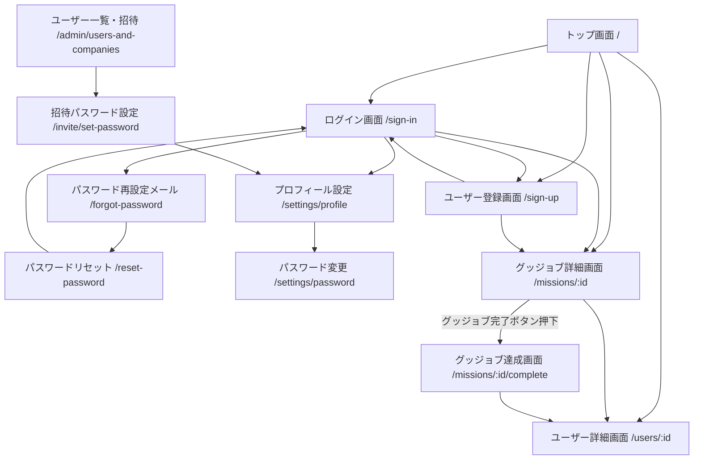

# サイトマップ

現状想定しているサービスの画面と、その画面遷移は以下。

```mermaid
flowchart TD
  top[トップ画面 /]
  signin[ログイン画面 /sign-in]
  signup[ユーザー登録画面 /sign-up]
  forgot[パスワード再設定メール /forgot-password]
  reset[パスワードリセット /reset-password]
  invite[招待パスワード設定 /invite/set-password]
  profile[プロフィール設定 /settings/profile]
  password[パスワード変更 /settings/password]
  adminUsers[ユーザー一覧・招待 /admin/users-and-companies]
  mission[グッジョブ詳細画面 /missions/:id]
  complete[グッジョブ達成画面 /missions/:id/complete]
  user[ユーザー詳細画面 /users/:id]

  top --> signin
  top --> signup
  top --> mission
  top --> user

  signin --> signup
  signin --> forgot
  signin --> profile
  forgot --> reset
  reset --> signin
  signup --> signin
  adminUsers --> invite
  invite --> profile
  profile --> password

  signin --> mission
  signup --> mission

  mission --グッジョブ完了ボタン押下--> complete
  mission --> user
  complete --> user
```
